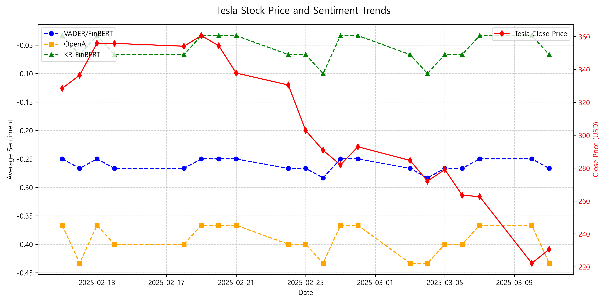
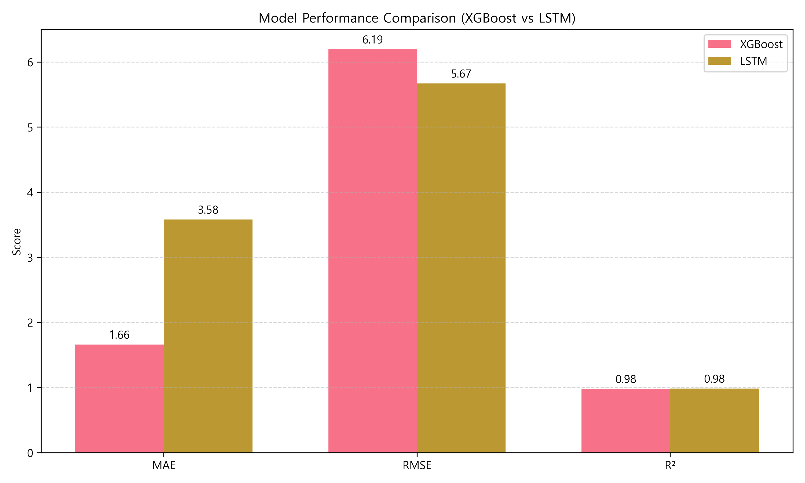

# 📌 Tesla 주가 예측을 위한 감성 분석 기반 시계열 모델링

## 🔍 프로젝트 개요

기업 뉴스는 투자자 심리와 주가 변동에 중요한 영향을 미칩니다.  
본 프로젝트는 뉴스 헤드라인을 기반으로 감성 분석을 수행하고,  
그 결과를 **LSTM 기반 시계열 예측 모델**과 **XGBoost 회귀 모델**에 적용해  
**테슬라(TSLA)**의 주가를 예측하는 것을 목표로 합니다.

- 감성 분석 도구: **VADER**, **FinBERT**, **OpenAI GPT API**, **KR-FinBERT**
- 예측 모델: **LSTM (딥러닝 시계열 모델)** vs **XGBoost (트리 기반 회귀 모델)**

---

## 📊 데이터 설명

### 📄 뉴스 데이터
- 출처: **네이버 뉴스 크롤링 (국내 매체)**
- 기간: 2025년 2~3월
- 수집량: 약 **900건**
- 전처리:
  - 중복 제거, HTML/특수문자 제거, 날짜 정제
  - 감성 점수 통일 (-1: 부정, 0: 중립, 1: 긍정)
  - 날짜 기준으로 **평균 감성 점수 집계**

### 📈 주가 데이터
- 출처: **Yahoo Finance** (`yfinance`)
- 종목: **TSLA**
- 기간: 2024년 12월 ~ 2025년 3월
- 주요 컬럼: Open, High, Low, Close, Volume
- 추가 지표:
  - 이동평균선: MA(10/50)
  - 모멘텀 지표: MACD
  - 변동성 지표: Volatility, 볼린저 밴드
  - 거래량 로그 변환: Volume_log
- 전처리:
  - 결측값 제거, MinMaxScaler 정규화
  - 뉴스 감성 점수와 날짜 기준 병합

---

## 🧠 분석 및 모델링

### 🔍 감성 분석 비교



- **OpenAI 감성 점수**가 주가 흐름과 가장 유사한 패턴
- **VADER/FinBERT**는 2분류 기준이라 민감도 낮음
- **KR-FinBERT**는 한국어 기반 → 영어 뉴스에선 한계 존재

---

### 📈 모델 성능 비교

| 모델       | 입력 데이터        | MAE   | RMSE  | R²    | 해석 |
|------------|--------------------|--------|--------|--------|-------|
| **XGBoost** | 기술 지표 + 감성 점수 | 1.97 | 2.35 | 0.69 | 감성 점수 포함 시 성능 저하, Close 의존도 과대 |
| **LSTM**    | 시계열 입력 + 감성 점수 | 5.08 | 6.99 | 0.87 | 감성 점수 반영 시 우수한 예측 성능 |

📊 시각화:



---

## 🔎 핵심 인사이트

- 감성 점수는 **XGBoost보다 LSTM**에서 효과적
- **OpenAI 감성 점수**가 가장 예측력 있음
- 뉴스 흐름은 **방향성 예측에 강점** → 투자 보조지표로 활용 가능
- 실전 적용 시 **API/알림 시스템, B2B SaaS**로 확장 가능

---

## 📁 프로젝트 구조

```
Tesla-Stock-Prediction
├── data                     # 원본 뉴스 및 주가 데이터
│   ├── tesla_news_sentiment.csv
│   └── tesla_stock.csv
├── notebooks                # 분석 노트북
│   └── Tesla_Stock_Prediction.ipynb
├── results                  # 시각화 결과 이미지
│   ├── average_sentiment_comparison.png
│   ├── sentiment_trend_over_time.png
│   ├── tesla_stock_and_sentiment_trends.png
│   └── model_comparison_xgb_lstm.png
├── .gitignore
├── README.md
└── requirements.txt
```

---

## 💻 실행 방법

```bash
# 1. 의존성 설치
pip install -r requirements.txt

# 2. 주피터 노트북 실행
jupyter notebook notebooks/Tesla_Stock_Prediction.ipynb
