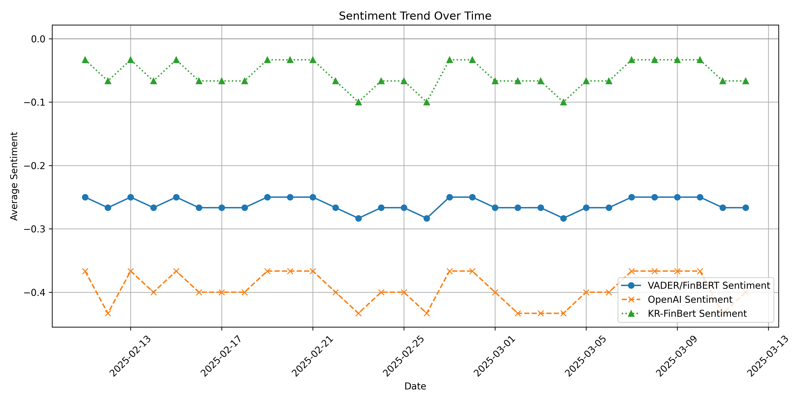

# 📌 Tesla Stock Price Prediction with Sentiment Analysis and LSTM

## 🔍 프로젝트 개요

이 프로젝트는 테슬라(Tesla)의 뉴스 데이터를 기반으로 **감성 분석(Sentiment Analysis)**을 진행하고, 이를 활용해 주가 예측을 하는 프로젝트입니다.

- 뉴스 데이터를 활용하여 sentiment 분석 (VADER, FinBERT, OpenAI GPT, KR-FinBERT)
- LSTM 모델을 사용한 주가 예측


## 📊 사용한 데이터

- **테슬라 주가 데이터**: Yahoo Finance (`yfinance`)
- **테슬라 뉴스 헤드라인 데이터**: 네이버 뉴스 크롤링 데이터

## ⚙️ 분석 방법 및 모델

### 감성 분석 비교


- **감성 분석(Sentiment Analysis)**:
  - VADER: 일반 텍스트 감성 분석
  - FinBERT: 금융 뉴스 특화 감성 분석
  - OpenAI GPT: 금융 전문가 시각에서의 sentiment 평가
  - KR-FinBERT: 한국어 금융 뉴스 sentiment 분석
- **시계열 예측 모델**:
  - LSTM (Long Short-Term Memory)

### 감성 분석 트렌드



## 🚀 프로젝트 디렉토리 구조

Tesla-Stock-Prediction
├── data
│ ├── tesla_news_sentiment.csv
│ └── tesla_stock.csv
├── notebooks
│ └── Tesla_Stock_Prediction.ipynb
├── results
│ └── average_sentiment_comparison.png
│ └── sentiment_trend_over_time.png
│ └── tesla stock and sentiment trends.png
├── .gitignore
├── README.md
└── requirements.txt

## 📉 주요 분석 결과

- **뉴스 sentiment와 테슬라 주가 간의 유의미한 상관관계**를 확인했습니다.
- OpenAI의 감성 분석 결과가 테슬라의 주가 움직임과 가장 밀접하게 관련되어 있었습니다.
- LSTM 모델을 통해 sentiment 데이터를 활용한 주가 예측 모델을 구현했습니다.

## 💻 코드 실행 방법

```bash
# 필요한 라이브러리 설치
pip install -r requirements.txt

# 주피터 노트북 실행
jupyter notebook notebooks/Tesla_Stock_Prediction.ipynb
```
